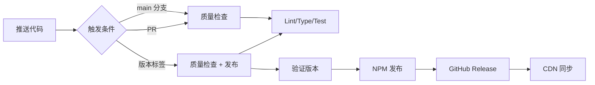

# 部署指南

本文档详细说明 @course-gen/chat-window 的自动化部署流程，所有部署都通过 GitHub Actions 自动完成。

## 📋 目录

- [部署概览](#部署概览)
- [GitHub Actions 工作流](#github-actions-工作流)
- [版本发布策略](#版本发布策略)
- [环境配置](#环境配置)
- [NPM 发布](#npm-发布)
- [CDN 部署](#cdn-部署)
- [监控与回滚](#监控与回滚)
- [故障排查](#故障排查)

## 🚀 部署概览

### 自动化流程



### 触发条件

- **持续集成（CI）**：推送到 main 分支或提交 PR
- **持续部署（CD）**：推送以 `v` 开头的标签（如 `v1.0.0`）

## 🔧 GitHub Actions 工作流

### 工作流文件

`.github/workflows/ci-cd.yml` 包含两个主要任务：

#### 1. Quality Check（质量检查）

**触发时机**：所有推送和 PR

**执行步骤**：

```yaml
- Checkout 代码
- 设置 Node.js 22
- 安装依赖 (npm ci)
- 安装 Playwright 浏览器
- 运行 Lint 检查
- 运行类型检查
- 构建项目
- 验证构建产物
- 运行测试
```

#### 2. Validate and Publish（验证和发布）

**触发时机**：仅在推送版本标签时

**执行步骤**：

```yaml
- 验证标签格式（使用 bump-version-js）
- 检查 package.json 版本匹配
- 发布到 NPM
- 创建 GitHub Release
- 生成发布总结
```

## 📦 版本发布策略

### 版本号规范

遵循语义化版本控制（Semantic Versioning）：

```
主版本号.次版本号.修订号[-预发布版本]
```

示例：

- `1.0.0` - 正式版本
- `1.0.0-alpha.1` - Alpha 测试版
- `1.0.0-beta.1` - Beta 测试版
- `1.0.0-rc.1` - 发布候选版

### 发布流程

1. **更新版本号**

   ```bash
   # 正式版本
   npm version patch  # 1.0.0 -> 1.0.1
   npm version minor  # 1.0.0 -> 1.1.0
   npm version major  # 1.0.0 -> 2.0.0

   # 预发布版本
   npm version prerelease --preid=alpha  # 1.0.0 -> 1.0.0-alpha.0
   npm version prerelease --preid=beta   # 1.0.0 -> 1.0.0-beta.0
   npm version prerelease --preid=rc     # 1.0.0 -> 1.0.0-rc.0
   ```

2. **创建并推送标签**

   ```bash
   # npm version 会自动创建标签
   git push origin main --tags
   ```

3. **自动发布**
   - GitHub Actions 自动执行 CI/CD 流程
   - 通过所有检查后自动发布

### 版本标签验证

使用 `bump-version-js` 验证版本格式：

- 必须符合 SemVer 规范
- 自动识别预发布版本类型
- 验证 package.json 版本匹配

## 🔑 环境配置

### 必需的 Secrets

在 GitHub 仓库设置中配置：

1. **NPM_TOKEN**
   - 获取方式：npm.com → Access Tokens → Generate New Token
   - 权限要求：Publish
   - 设置路径：Settings → Secrets → Actions

### 权限配置

工作流需要的权限（已在 yml 中配置）：

```yaml
permissions:
  contents: write # 创建 Release
  pages: write # 部署文档（如需要）
  id-token: write # OIDC 认证
```

## 📤 NPM 发布

### 发布配置

`package.json` 关键配置：

```json
{
  "name": "@course-gen/chat-window",
  "publishConfig": {
    "access": "public",
    "registry": "https://registry.npmjs.org/"
  },
  "files": ["dist"]
}
```

### 发布策略

1. **正式版本**
   - 发布到 `latest` 标签
   - 命令：`npm publish --access public`

2. **预发布版本**
   - Alpha：发布到 `alpha` 标签
   - Beta：发布到 `beta` 标签
   - RC：发布到 `rc` 标签
   - 命令：`npm publish --access public --tag [tag]`

### 版本验证

发布后自动验证：

```bash
npm view @course-gen/chat-window@[version] version
```

## 🌐 CDN 部署

### jsDelivr 自动同步

NPM 包发布后，jsDelivr 会自动同步：

**访问地址**：

```
# 最新版本
https://cdn.jsdelivr.net/npm/@course-gen/chat-window

# 指定版本
https://cdn.jsdelivr.net/npm/@course-gen/chat-window@1.0.0

# 具体文件
https://cdn.jsdelivr.net/npm/@course-gen/chat-window@1.0.0/dist/index.js
```

### CDN 配置

`package.json` 中的 CDN 优化：

```json
{
  "jsdelivr": "dist/index.js",
  "unpkg": "dist/index.js"
}
```

### 缓存刷新

- jsDelivr 通常在 NPM 发布后 10 分钟内同步
- 强制刷新：访问 `https://purge.jsdelivr.net/npm/@course-gen/chat-window`

## 📊 监控与回滚

### 发布监控

1. **GitHub Actions 监控**
   - 查看工作流运行状态
   - 检查步骤日志
   - 查看发布总结（Summary）

2. **NPM 监控**

   ```bash
   # 查看包信息
   npm info @course-gen/chat-window

   # 查看所有版本
   npm view @course-gen/chat-window versions --json

   # 查看特定版本
   npm view @course-gen/chat-window@1.0.0
   ```

3. **下载量统计**
   - NPM：https://www.npmjs.com/package/@course-gen/chat-window
   - jsDelivr：https://www.jsdelivr.com/package/npm/@course-gen/chat-window/stats

### 回滚策略

#### 1. NPM 回滚

**弃用有问题的版本**：

```bash
npm deprecate @course-gen/chat-window@1.0.1 "This version has critical bugs"
```

**推荐旧版本**：

```bash
# 更新 latest 标签指向
npm dist-tag add @course-gen/chat-window@1.0.0 latest
```

#### 2. 紧急修复流程

1. 切换到稳定版本的代码
2. 创建修复分支
3. 应用修复
4. 发布补丁版本

```bash
# 基于稳定版本创建修复
git checkout v1.0.0
git checkout -b hotfix/critical-bug

# 修复后发布
npm version patch
git push origin main --tags
```

## 🐛 故障排查

### 常见问题

#### 1. 版本不匹配错误

**问题**：`package.json version doesn't match tag version`

**解决**：

```bash
# 确保版本号一致
npm version [version] --no-git-tag-version
git add package.json package-lock.json
git commit -m "chore: update version to [version]"
git tag v[version]
git push origin main --tags
```

#### 2. NPM 发布失败

**问题**：`401 Unauthorized`

**检查**：

- NPM_TOKEN 是否有效
- Token 权限是否正确
- 是否已登录正确的 NPM 账号

#### 3. 构建产物缺失

**问题**：`All build files not present`

**检查**：

- `dist/index.js` 是否生成
- `dist/index.d.ts` 是否生成
- `vite.config.ts` 配置是否正确

### 调试技巧

1. **本地模拟 CI 环境**

   ```bash
   # 使用 act 运行 GitHub Actions
   act push --secret NPM_TOKEN=$NPM_TOKEN
   ```

2. **验证构建产物**

   ```bash
   npm run build
   ls -la dist/
   ```

3. **测试发布流程**
   ```bash
   # 干运行，不实际发布
   npm publish --dry-run
   ```

## 📝 检查清单

### 发布前检查

- [ ] 所有测试通过
- [ ] 更新了 CHANGELOG
- [ ] 版本号正确更新
- [ ] 文档已更新
- [ ] 无敏感信息泄露

### 发布后验证

- [ ] NPM 包可以正常安装
- [ ] jsDelivr CDN 可访问
- [ ] GitHub Release 创建成功
- [ ] 类型定义文件正确

## 🔐 安全注意事项

1. **保护 Secrets**
   - 定期轮换 NPM Token
   - 使用最小权限原则
   - 监控异常发布活动

2. **代码审查**
   - 发布前进行代码审查
   - 使用 PR 保护规则
   - 启用分支保护

3. **依赖安全**
   - 定期更新依赖
   - 使用 `npm audit`
   - 配置 Dependabot

## 📞 支持渠道

- GitHub Issues：报告问题
- GitHub Discussions：技术讨论
- NPM Support：包发布问题
- 邮件：deploy@course-gen.com
